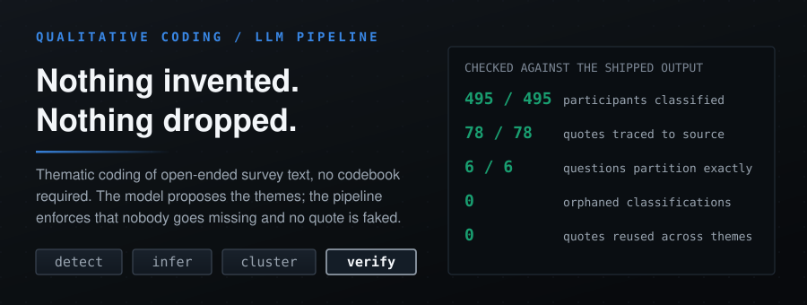
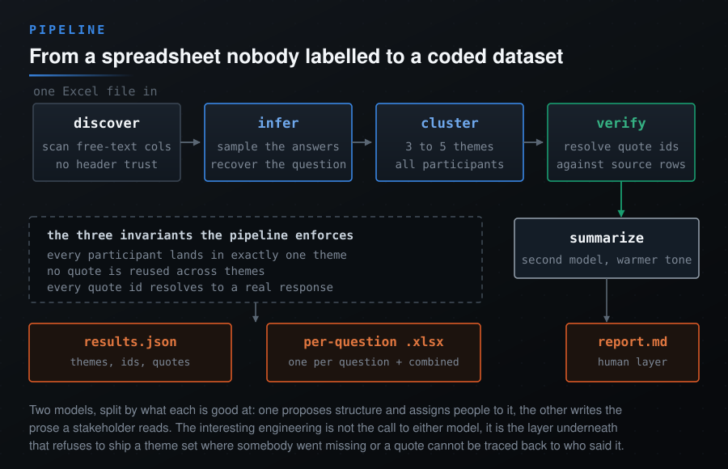
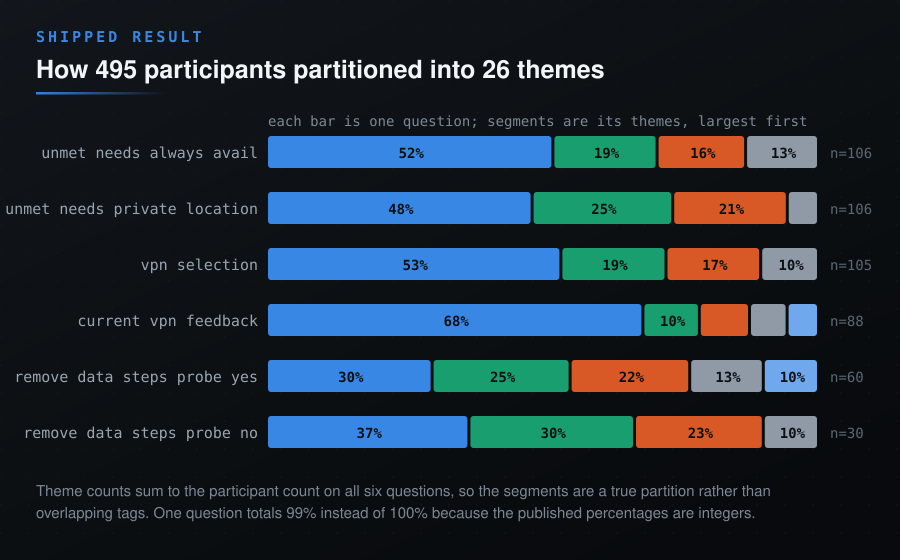

<p align="center">
  
</p>

<div align="center">

<b><font size="6">Agentic Research for Thematic Analysis</font></b>

<br/>


<br/><br/>

<strong>Thematic coding of open-ended survey text, with no predefined codebook.</strong><br/>
The model proposes the themes. The pipeline is what refuses to ship a result<br/>
where somebody went missing or a quote cannot be traced back to who said it.

<br/>

<code>discover -> infer -> cluster -> verify</code>

</div>

---

## The problem with letting a model code your data

Hand a language model 500 free-text survey answers and ask for themes, and it will give you themes. It will also, quietly:

- drop the people who did not fit neatly, so your percentages describe a subset you cannot name
- reuse the same vivid quote under three different themes, which makes weak themes look independently supported
- produce a quote that reads perfectly and appears nowhere in your data

None of those failures announce themselves. The output looks clean either way, which is exactly the problem: a thematic analysis is a claim about what a population said, and a claim you cannot audit is not evidence. The interesting engineering here is not the call to either model. It is the layer underneath that decides whether the model's answer is allowed to ship.

## What it actually does

<p align="center">
  
</p>

<details>
<summary>Graph source for this pipeline</summary>

```mmd
flowchart LR
    X["Excel file, no schema assumed"] --> D["discover: scan for free-text columns"]
    D --> I["infer: recover the question from the answers"]
    I --> C["cluster: 3 to 5 themes, assign every participant"]
    C --> V["verify: resolve quote ids against source rows"]
    V --> S["summarize: second model, warmer tone"]
    V --> J["results.json"]
    V --> XL["per-question .xlsx + combined sheet"]
    S --> MD["report.md"]
```

</details>

**Discover.** Column headers in survey exports are unreliable (`Q7_open`, `unmet_needs_2`, or a truncated fragment of the question). So the ID column and the free-text columns are found by inspecting the values, not by trusting names.

**Infer.** The question is reconstructed from a sample of the answers themselves. If a hundred people describe getting locked out of a service, the question was about access friction, whatever the header says. This runs at temperature 0.3: enough freedom to phrase it naturally, not enough to invent a question nobody was asked.

**Cluster.** Themes come from the shape of the data, 3 to 5 per question, and every participant is assigned to exactly one. Also 0.3.

**Verify.** The model returns quote *ids*, never quote text. Ids are resolved against the source rows, so a fabricated quote cannot survive the round trip: it has no id to resolve. Quotes are then deduplicated globally, capped at three per theme.

**Summarize.** A different model at 0.5 writes the headline and executive summary. Splitting it is deliberate: the task that must not drift (assigning real people to real categories) and the task that benefits from drift (readable prose) should not share a temperature.

## The receipts

Every number below is re-derived from `output/results.json` by `docs/generate_visuals.py`, not typed by hand.

| Invariant | Checked | Result |
|---|---|---|
| Every participant is classified | `len(classifications) == n_participants`, per question | **495 / 495**, 6 of 6 questions |
| Themes partition the population | `sum(theme.count) == n_participants` | **6 of 6** questions exact |
| No quote is reused across themes | quote ids unique within a question | **0** reuses across 78 quote slots |
| No classification names a phantom theme | every label resolves to a real theme | **0** orphans |

<p align="center">
  
</p>

The shipped run covers 6 questions and 495 participants from a VPN research study, producing 26 themes. One question's percentages total 99 rather than 100 because the published values are integers; the underlying counts still sum exactly.

## How It Works

The diagram above is the shape of it. The full graph, including every subgraph and the exact node names, is below as source rather than a second rendered picture.

<details>
<summary>Full graph source</summary>

```mmd
%%{init: {'flowchart': {'curve': 'linear', 'nodeSpacing': 26, 'rankSpacing': 52, 'padding': 16}}}%%
flowchart TB
    subgraph Input["Input"]
        EXCEL[("Excel File")]
    end

    subgraph Discovery["Column Discovery"]
        FIND_ID["Find ID Column"]
        FIND_QS["Find Question Columns\nauto-detect text responses"]
    end

    subgraph Inference["Question Inference"]
        SAMPLE["Sample Responses"]
        INFER[("Claude Opus 4.5")]
    end

    subgraph Analysis["Analysis Engine"]
        subgraph ThemeGen["Theme Generation"]
            PROMPT1["Build Theme Prompt"]
            CLAUDE1[("Claude Opus 4.5")]
            PARSE1["Parse JSON"]
        end
        
        subgraph QuoteExt["Quote Extraction"]
            LOOKUP["Response Lookup"]
            UNIQUE["Deduplicate Quotes"]
            LIMIT["Limit 3 per Theme"]
        end
        
        subgraph SummaryGen["Summary Generation"]
            PROMPT2["Build Summary Prompt"]
            GPT1[("GPT-5.1")]
            PARSE2["Parse JSON"]
        end
    end

    subgraph Processing["Post-Processing"]
        CALC["Calculate Percentages"]
        SORT["Sort by Size"]
        CLEAN["Clean Text"]
    end

    subgraph Output["Output"]
        JSON[("results.json")]
        MD[("report.md")]
    end

    EXCEL --> FIND_ID
    EXCEL --> FIND_QS
    FIND_QS -- "text columns" --> SAMPLE
    SAMPLE --> INFER
    
    INFER --> PROMPT1
    PROMPT1 --> CLAUDE1
    CLAUDE1 --> PARSE1
    
    PARSE1 --> LOOKUP
    LOOKUP --> UNIQUE
    UNIQUE -- "max 3" --> LIMIT
    
    PARSE1 -- "theme sizes" --> CALC
    CALC --> SORT
    SORT --> PROMPT2
    
    PROMPT2 --> GPT1
    GPT1 --> PARSE2
    
    LIMIT --> CLEAN
    PARSE2 --> CLEAN
    
    CLEAN -- "machine" --> JSON
    JSON -- "human" --> MD

    classDef src fill:#4CAF50,color:#fff,stroke:#2E7D32,stroke-width:2px
    classDef proc fill:#78909C,color:#fff,stroke:#455A64,stroke-width:2px
    classDef claude fill:#FFA726,color:#fff,stroke:#E65100,stroke-width:2px
    classDef gpt fill:#5C6BC0,color:#fff,stroke:#303F9F,stroke-width:2px
    classDef out fill:#EF5350,color:#fff,stroke:#C62828,stroke-width:2px

    class EXCEL src
    class FIND_ID,FIND_QS,SAMPLE,PROMPT1,PARSE1,LOOKUP,UNIQUE,LIMIT,PROMPT2,PARSE2,CALC,SORT,CLEAN proc
    class INFER,CLAUDE1 claude
    class GPT1 gpt
    class JSON,MD out

    style Input fill:#eceff1,stroke:#b0bec5,stroke-width:1px,color:#37474F
    style Discovery fill:#eceff1,stroke:#b0bec5,stroke-width:1px,color:#37474F
    style Inference fill:#eceff1,stroke:#b0bec5,stroke-width:1px,color:#37474F
    style Analysis fill:#f5f7f8,stroke:#b0bec5,stroke-width:1px,color:#37474F
    style ThemeGen fill:#eceff1,stroke:#b0bec5,stroke-width:1px,color:#37474F
    style QuoteExt fill:#eceff1,stroke:#b0bec5,stroke-width:1px,color:#37474F
    style SummaryGen fill:#eceff1,stroke:#b0bec5,stroke-width:1px,color:#37474F
    style Processing fill:#eceff1,stroke:#b0bec5,stroke-width:1px,color:#37474F
    style Output fill:#eceff1,stroke:#b0bec5,stroke-width:1px,color:#37474F
```

</details>


## What It Does

- Reads any Excel file with survey responses
- Auto-detects which columns are questions
- Infers the actual question text from responses (not just column names)
- Groups responses into 3-5 themes per question (based on natural clustering)
- Picks representative quotes without duplicates
- Writes executive summaries
- Outputs JSON and Markdown

## Features

| Feature | Description |
|---------|-------------|
| Dual Model | Claude Opus 4.5 for extraction, GPT-5.1 for summaries |
| Project Background | Pass research context to improve theme relevance |
| Question Inference | Figures out what was asked by looking at responses |
| Dynamic Columns | Extracts question columns automatically from your Excel |
| Variable Themes | 3-5 themes based on natural clustering in the data |
| Parallel Analysis | Questions analyzed concurrently (6 workers default) |
| Classification Export | Excel files showing participant → theme mappings |
| Quote Validation | Verifies quotes exist in source data |
| Senior Research Tone | Authoritative, $500/hour consultant voice |
| Unique Quotes | No quote appears twice across themes |

## Setup

```bash
pip install -r requirements.txt
export ANTHROPIC_API_KEY="your-key"
export OPENAI_API_KEY="your-key"
```

## Usage

```bash
# Basic usage
python src/pipeline.py survey_data.xlsx output/results.json

# With project background context (recommended)
python src/pipeline.py survey_data.xlsx output/results.json project_background.txt

# Generate markdown report
python src/report.py output/results.json output/report.md
```

### Project Background Parameter

The pipeline accepts an optional `project_background` parameter that provides research context. This context is used to:

1. Inform question inference (better understanding of what was asked)
2. Guide theme generation (themes align with research objectives)
3. Shape summary language (relevant to project goals)

Example `project_background.txt`:
```
Primary Goal: Understand the consumer privacy market, specifically VPNs and data deletion services.

Learning Objectives:
- Size and segment the market
- Identify key use cases and pain points
- Assess willingness to pay
```

### Classification Export

After analysis, the pipeline automatically exports classification files to `output/classifications/`:

- `{column}_classifications.xlsx` - Per-question participant → theme mappings
- `all_classifications.xlsx` - Combined view across all questions

These files enable manual review of theme assignments for accuracy verification.

### Concurrency

Questions are analyzed in parallel (default: 6 workers). Adjust `MAX_WORKERS` in `pipeline.py` based on API rate limits.

The pipeline will automatically find:
- The ID column (looks for "id", "participant_id", etc.)
- Question columns (any column with text responses longer than 20 chars average)
- The actual question text (inferred from how people responded)

### Question Inference Example

Instead of guessing from column names like `vpn_selection`, the pipeline samples responses and asks Claude what question was likely asked:

| Column | Inferred Question |
|--------|-------------------|
| vpn_selection | What factors were most important when selecting your VPN? |
| current_vpn_feedback | What features do you wish your VPN had? |
| remove_data_steps_probe_no | Would you be interested in removing your personal information from online databases? |

## Project Structure

```
usercue-thematic-analysis/
├── src/
│   ├── __init__.py
│   ├── pipeline.py        # Main analysis
│   └── report.py          # Report generator
├── tests/
│   ├── __init__.py
│   └── test_pipeline.py   # Unit tests
├── docs/
│   ├── ARCHITECTURE.md
│   └── USAGE.md
├── output/
│   ├── results.json
│   ├── report.md
│   └── classifications/   # NEW: Theme assignment files
│       ├── vpn_selection_classifications.xlsx
│       ├── current_vpn_feedback_classifications.xlsx
│       └── all_classifications.xlsx
├── project_background.txt # NEW: Research context
├── .gitignore
├── requirements.txt
└── README.md
```

## Output Format

```json
{
  "column_name": {
    "question": "What factors influenced your decision when choosing your VPN?",
    "n_participants": 105,
    "headline": "Key insight under 8 words",
    "summary": "1-2 sentences with actionable recommendation",
    "themes": [
      {
        "title": "Theme title",
        "description": "3-4 sentences. Senior researcher voice.",
        "pct": 38,
        "quotes": [
          {"participant_id": "4434", "quote": "What they said"}
        ]
      }
    ]
  }
}
```

## Configuration

| Setting | Value | Purpose |
|---------|-------|---------|
| Claude Model | claude-opus-4-5-20251101 | Theme extraction |
| GPT Model | gpt-5.1 | Summary generation |
| Extraction Temp | 0.3 | Balanced accuracy and natural language |
| Summary Temp | 0.5 | Natural language variation |
| Inference Temp | 0.3 | Natural question phrasing |

## Example Output

**Privacy and Security Focus** (37%)

Privacy concerns dominate selection criteria, with no-logs policies ranking as the top priority. Encryption strength matters more than server count for this segment. Strong preference exists for transparent security certifications, and most participants specifically mention identity protection. This represents premium customers willing to pay for verified privacy.

## Tests

```bash
pytest tests/ -v
```

## Design Discussion

### Approach

- **Dual-model architecture**: Claude Opus 4.5 handles structured extraction (theme generation, participant classification, quote selection) because it follows JSON schemas reliably. GPT-5.1 writes summaries because it produces more natural executive prose.
- **Question inference from responses**: Rather than relying on cryptic column names like `vpn_selection`, the pipeline samples responses and infers what question was actually asked. This makes the output immediately usable without manual mapping.
- **Semantic theme generation**: Themes are generated based on response content, not keyword matching. The prompt instructs the model to find 3-5 natural clusters with appropriate generality.

### Design Decisions

- **Temperature tuning**: Theme extraction uses 0.3 (was 0.1, raised for more natural descriptions) to balance accuracy with varied language. Summaries use 0.5 for natural variation. Question inference uses 0.3 for fluent phrasing.
- **3-5 themes default**: The prompt explicitly discourages defaulting to 5 themes. Fewer themes with stronger cohesion beats more themes with overlap.
- **Quote selection via `best_quote_ids`**: The model selects the 3 participant IDs whose quotes best support each theme description, then we fetch verbatim quotes from source data. This prevents hallucination.
- **Global quote deduplication**: Quotes are tracked across all themes per question. No quote appears twice.
- **One quote per participant per theme**: Each theme can only cite a given participant once.
- **100% classification enforcement**: Post-processing ensures every participant is assigned to exactly one theme, even if the model misses some.

### Assumptions

- Excel files have an ID column (auto-detected by looking for "id", "participant_id", etc.)
- Question columns contain text responses averaging >20 characters
- Blank/null responses are excluded from analysis
- Participant IDs are unique within the dataset

### Tradeoffs

| Decision | Benefit | Cost |
|----------|---------|------|
| Two models | Best of both (precision + prose) | Higher latency, two API keys |
| Quote validation | Zero hallucinated quotes | Extra processing step |
| Concurrent execution | ~6x faster for 6 questions | Higher API rate limit usage |
| Temperature 0.3 for themes | More varied descriptions | Slightly less deterministic |

### Production Considerations

- **Rate limiting**: Would add exponential backoff and retry logic for API failures
- **Caching**: Cache theme responses by content hash to avoid re-running identical analyses
- **Streaming**: Stream results to UI as each question completes rather than waiting for all
- **Embedding-based classification**: For missing participant assignment, use embeddings to find semantically closest theme instead of defaulting to largest
- **Human-in-the-loop**: Add a review step where analysts can reclassify edge cases before final output
- **Audit logging**: Log all model inputs/outputs for debugging and compliance
- **Cost tracking**: Track token usage per run for budgeting
- **Schema validation**: Use Pydantic models to validate JSON responses before processing
- **Multi-language support**: Detect response language and adjust prompts accordingly
- **Batch API**: For large datasets, use Claude's batch API to reduce costs

### Future Improvements

- **Single model**: In production, I'd likely consolidate to Claude for everything (summaries too) to reduce complexity and API dependencies
- **Structured outputs**: Use Claude's native JSON mode / tool use for more reliable parsing
- **Incremental analysis**: For very large datasets, process in batches with intermediate saves
- **Theme refinement loop**: Add a second pass where themes are reviewed and merged if too similar
- **Confidence scores**: Have the model output confidence per classification to flag uncertain assignments

## Docs

- [Architecture](docs/ARCHITECTURE.md)
- [Usage Guide](docs/USAGE.md)
